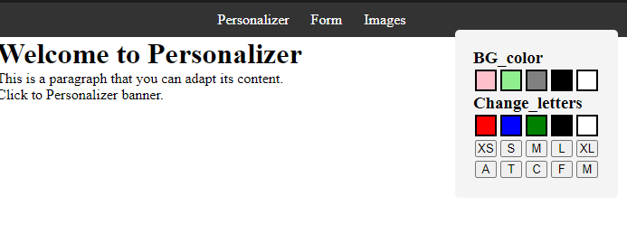
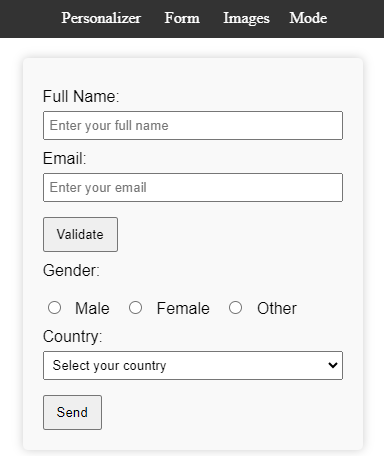
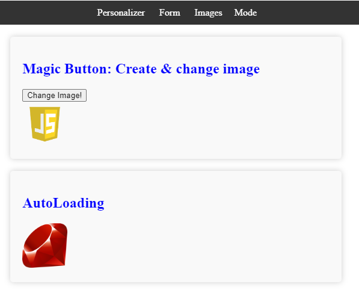

# ProjectoJS

[Personalizer.html](#personalizer)

[Form.html](#form)

[Images.html](#images)

## Personalizer

En esta pagina podra elegir el boton para personalizer la pagina , como cambiar el fodo de esta misma , el color de texto , tamaño y fuente

## Form

En este formulario deberas completar e lapartado de **Full name** , **Email**,seleccionar tu genero en **Gender** y elegir la opción en donde vives en **Country**.

## Images

Habrá 2 secciones , en una podrás presionar en el boton **Change Image!** para cambiar de imagen aleatoriamente.\
Mientras que en la otra sección se cambiará de manera automatica entre imagenes

